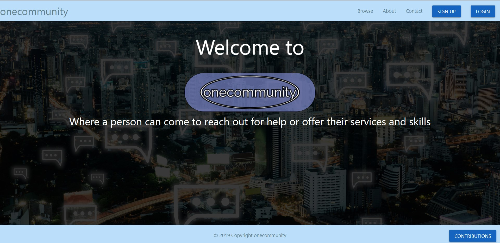
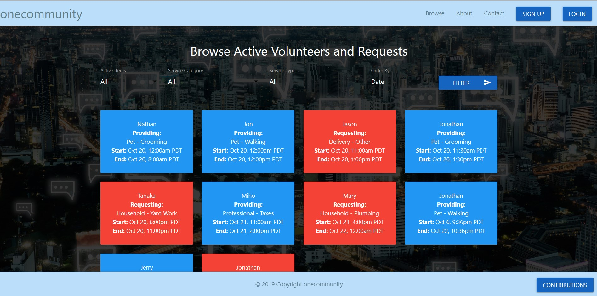
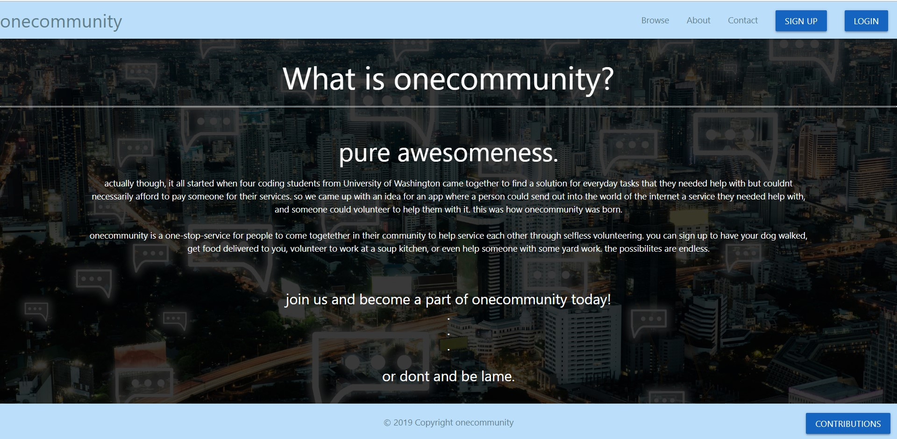
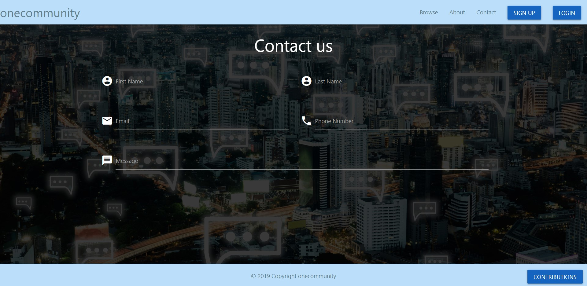
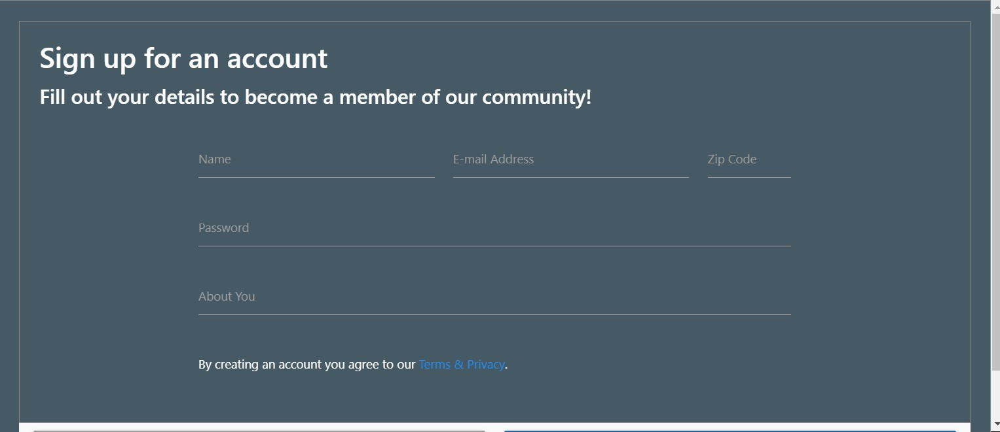
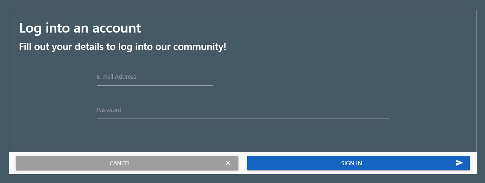

# ONECOMMUNITY
**An app that connects members to a global community of volunteers to help each other in need.**

 

##Intro
Before the rise of the internet when people needed help, they would reach out to their community. The newspaper brought in want adds and then with the internet, forums, craigslist and eventually social media. With all these the range that one could reach out increased greatly but a new problem arose. The problem being there are now too many avenues for so many different types of services provided.

Rover for walking your watching or walking your pet. Uber eats for food delivery. TaskRabbit for handyman work. All of these are fantastic yet require managing multiple apps. 
With onecommunity you can now have all these in one place.

 

###Visiting the page

When the user visits the site, they can choose to browse through the services offered and existing requests, 

visit the about page

reach out over the contact page (connection TBD)

 or sign up for an account or login to an existing one.

